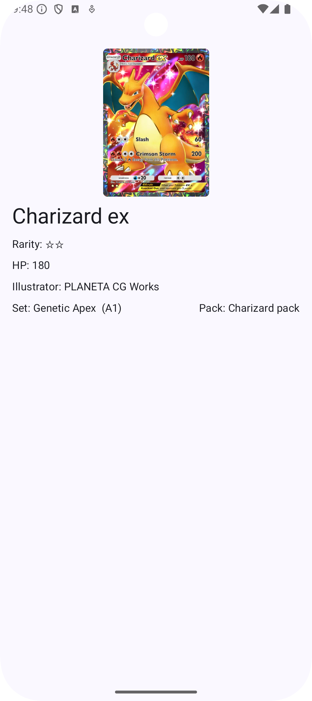

# TCG Pocket tracker android app

Simple android app that lets you track your TCG collection. It recommends which pack to open based
on the cards you are missing.

## Architecture

The app is built using the MVVM architecture. It uses the following libraries:

- [Jetpack Compose](https://developer.android.com/jetpack/compose)
- [Navigation Compose](https://developer.android.com/jetpack/compose/navigation)
- [Flow](https://developer.android.com/kotlin/flow)
- [Coroutines](https://kotlinlang.org/docs/coroutines-overview.html)
- [Room](https://developer.android.com/jetpack/androidx/releases/room)
- [Hilt](https://developer.android.com/training/dependency-injection/hilt-android)
- [Retrofit](https://square.github.io/retrofit/)
- [Type safe navigation](https://developer.android.com/jetpack/compose/navigation#typesafe)

## Screenshots

| List                                      | Detail                                           |
|-------------------------------------------|--------------------------------------------------|
|  |  |
